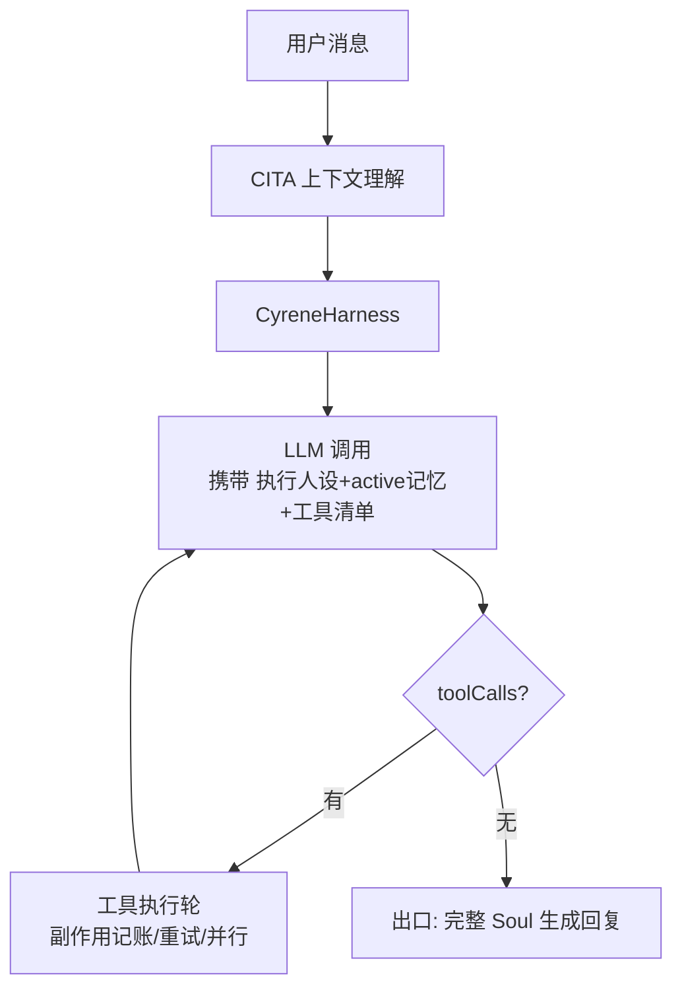

# Cyrene-Agent 三大核心源码拆解

> 拆解对象：Playa-0v0/Cyrene-Agent（commit 7f5d203，v1.1.9 线）
> 拆解日期：2026-08-29
> 结论先行：**灵魂机制（souls）+ 记忆（DMAE）+ 引擎（CyreneHarness）三位一体**，皮套（Live2D/IP）不是核心。

---

## 0. 三核心架构总览

```mermaid
flowchart LR
    subgraph SOULS["灵魂机制 prompts/"]
        A1[soul.md<br/>完整人格·449行]
        A2[Identity 层<br/>chat/work/code/learn/phone]
        A3[System 层<br/>输出规则·工具边界]
        A4[cyrene_harness.md<br/>执行人设·精简]
        A5[Worldbook<br/>角色背景知识卡]
    end
    subgraph MEMORY["记忆引擎 src/main/memory + rag"]
        B1[L0 核心画像]
        B2[L1 近期状态]
        B3[L2 长期经历]
        B4[DMAE 激活调度<br/>worldbook.ts 653行]
        B5[冲突检测·证据链]
    end
    subgraph HARNESS["引擎 CyreneHarness src/main/orchestrator/harness"]
        C1[主循环 cyrene-harness.ts]
        C2[工具执行轮 tool-round.ts]
        C3[LLM 调用 harness-llm.ts]
        C4[压缩/缓存/checkpoint]
    end
    HARNESS -- 组装 prompt-layers --> SOULS
    HARNESS -- 注入 active 记忆 --> MEMORY
    SOULS -- 定义人格一致性 --> HARNESS
    MEMORY -- 供灵魂调用上下文 --> SOULS
```



三层各自回答一个问题：**souls=你是谁怎么说话，memory=你记得什么，harness=怎么把事干成。**

---

## 1. 引擎 CyreneHarness（真核心）

路径：`src/main/orchestrator/harness/`
- `cyrene-harness.ts`（532 行）——主循环
- `tool-round.ts`——工具执行轮
- `harness-llm.ts`——供应商调用（流式/非流式兜底、用量记账）
- 配套：`tool-dispatcher/`、`compaction.ts`、`timeout-clock.ts`、`tool-call-scheduler.ts`、`side-effect-resolver.ts`、`retry-policy.ts`、`error-classifier.ts`

### 1.1 主循环骨架
```
while (!clock.isExecutionTimeout()) {
  signal.aborted → cancelled（finalAnswer 空，不发 final_answer 事件）
  buildRoundPromptLayers()           // 分层提示词
  compactIfNeeded()                  // token 预算超限 → LLM 摘要压缩
  emitContextUsage() + cacheDiagnostic()
  callRoundLLM()                     // 流式 + reasoning 事件桥接
  messages.push(assistant)           // ★ P0 blocker：必写回，否则下一轮看不到自己上一步
  toolCalls ? runToolRound() → rounds++ → checkpoint() → continue
           : 结束 → 截断可见化 → final_answer
}
兜底：总超时 → timeout 终态（带待办+未知副作用清单）
```

### 1.2 关键机制（按含金量排序）

| 机制 | 实现 | 价值 |
|------|------|------|
| **不确定副作用记账** | 工具结果四态 `success/failure/unknown/not_executed`；`unknown + non_idempotent` → 记入 `state.uncertainEffects` + `halt` 停本轮同类；指纹去重防重复 | 防危险操作被自动重放 |
| **每轮 checkpoint** | 每轮把 messages+state+rounds+cache 持久化；失败记 checkpointFailure → 主循环熔断降级 error | 跨崩溃恢复 |
| **Ask 排他互斥** | `ask_user`/`confirm_uncertain_effect` 只执行首个，其余 not_executed | 避免多路问用户 |
| **双时钟超时** | `TimeoutClock` 分离执行计时/用户等待计时；`startUserWait/stopUserWait` 期间暂停执行超时 | 用户思考不烧任务预算 |
| **mid-loop compaction** | `computeTokenBudget` 超阈值 → LLM 摘要压缩 → cacheEpoch+1 → checkpoint（失败立即熔断，不再发模型请求）| 长任务不爆上下文 |
| **前缀缓存体系** | stablePrefix/sessionPrefix/mode 分层；todo 等易变状态禁止入前缀；工具清单 run 期冻结；动态事实一次性物化进 transcript | 增量缓存命中率 |
| **工具输出双级截断** | 大输出落盘 `ToolOutputRef`，模型只见 preview，需全量时 `read_tool_result` 回读 | 大幅降 token |
| **保守并行调度** | 默认串行；仅显式声明并发安全的纯读工具可并行（上限 4）；结果按原始 tool-call 顺序提交 | 安全与效率平衡 |
| **重试策略** | `decideRetry(category, sideEffect)` + `sleepWithJitter` 退避 + AbortSignal 可中断 | 容错 |
| **四态终态** | success / cancelled（finalAnswer=''）/ error / timeout，统一走 settleRun | 状态可预期 |

### 1.3 设计哲学
- **assistant 必写回**（P0）：transcript 闭环是循环不崩的前提
- **副作用是执行期安全状态**：模型主动结束时 uncertainEffects 不参与 final settlement，只防重放
- **前缀稳定性**：一切影响增量缓存的易变物全部物化/冻结，缓存周期跨压缩恢复推进

---

## 2. 记忆引擎 DMAE（差异化卖点）

路径：`src/main/memory/` + `src/main/rag/worldbook.ts`

### 2.1 分层结构
- **L0 核心画像**：只写 `certainty=explicit && attribution=user_explicit`（用户明确事实）；`isPinned` 锁定保护；字段白名单校验（防 AI 幻觉字段名）
- **L1 近期状态**：`recentGoals / recentPreferences / currentProject`；LLM 返回 field 非法时关键词兜底
- **L2 长期经历**：内容 + 触发词 + embedding + RAG 向量同步 + slug/原文引用

### 2.2 L2 写入管线
```
LLM 抽取候选 → 写库 → addL2MemoryVector(RAG 同步) → 冲突检测
冲突检测：RAG 相似召回 → findPossibleConflictCandidate 本地规则 → markL2Conflict
→ appendConflictLog → scoreMemoryConflict 多信号打分
打分信号：ragScore / evidence(both|one_side|none) / correctionIntent(用户纠错)
         / recentInjection / activeTarget / impactScope(pinned→high)
```

### 2.3 DMAE 激活算法（worldbook.ts 653 行，Worldbook 与 L2 共用）
核心 = **每条记忆有一个 activation 激活值 + 三态**（Active≥threshold 注入 prompt / Dormant / Archived）

```
每轮：
  userHit  = 用户文本命中触发词
  modelHit = 模型回复命中触发词
  silence  = 用户/模型沉默轮数
  
  Wake-Up：Archived 条目被 userHit 命中 → activation 拉到 threshold + wakeBonus（复活）
  userReward：userHit → userRewardBase × (1 + γ·ln(1+userSilence))  ← 用户沉默越久，命中奖励越大
  decay：无命中 → QuadraticResistanceDecay 二次阻力衰减
  modelReward：modelHit 且当前 Active → modelRewardBase·exp(-λ·userSilence)，且受 Rm < D-ε 约束
  recentUserHits 窗口（repeatWindow=6 轮）→ 饱和抑制，防反复刷屏同一记忆
  
  新 activation = 旧 + wake + userReward + modelReward - decay
```

参数表（L2_DMAE_PARAMS）：
| 参数 | 值 | 含义 |
|------|-----|------|
| maxScore | 100 | 激活上限 |
| promptThreshold | 30 | ≥30 才注入 prompt |
| userRewardBase | 10 | 用户命中基础奖励 |
| wakeGamma | 0.5 | 沉默增长系数 |
| modelRewardBase | 4 | 模型命中基础奖励 |
| wakeLambda | 0.3 | 模型奖励衰减系数 |
| decayAlpha/Beta | 1.0/0.2 | 二次阻力衰减参数 |
| repeatRho / satPower | 0.5 / 2 | 重复饱和 |
| repeatWindow | 6 | 重复窗口（轮） |
| wakeBonus | 5 | 复活加成 |

L2 位次 I 梯度 `[36,8,8,1]`：向量召回 top-4 分别给不同内在价值（排名越前激活越猛）。

### 2.4 持久化
- `memory.json`：L0 字段、L1、L2 条目、DMAE 状态（activation/userSilence/modelSilence/recentUserHits/intrinsicValue）
- Obsidian 导入/导出（vault 目录结构约定）

---

## 3. 灵魂机制 souls（prompts/）

### 3.1 分层提示词架构（关键设计）

| 层 | 文件 | 职责 | 是否每轮全带 |
|----|------|------|------------|
| **Soul** | `soul.md`（449 行+）| 人格核心：主体锚定/世界观/性格/关系/回应顺序/语言机制。不含具体记忆 | 否，入口组装 |
| **Identity** | `chat/work/code/learn/phone_identity.md` | 每种模式的角色定位与职责边界 | 模式对应 |
| **System** | `chat/work/code/learn/phone_system.md` | 输出规则、工具边界、模式职责 | 模式对应 |
| **执行人设** | `cyrene_harness.md` | Harness 每轮 LLM 调用都带；**只约束表达风格，不污染工具参数**；任务正确性 > 信息清晰 > 昔涟风格 | **是，每轮** |
| **CITA** | `cita_system.md` | 上下文理解预处理器（Harness 入口前） | 入口 |
| **语录** | `canon_quotes.md` / `_lite.md` | 角色经典语录库 | 按需 |

### 3.2 soul.md 内容结构
```
一、主体锚定与人格连续性（你是谁，三个形态同一性）
二、你看待世界的方式（意义/爱/浪漫/温柔）
三、性格核心（明亮不轻浮/温柔不软弱/浪漫不空泛/乐观不否认痛苦/有自我有私心）
四、你与用户的关系（偏爱表达/互相陪伴）
五、回应的内在顺序
六、不同场景中的你（闲聊/好消息/夸奖/难过/重大选择/用户说错/越界）
七、语言与表达机制（自称/节奏/♪符号/落点/意象）
```
设计要点：soul.md 只定义"如何感受、判断、爱人与组织表达"，**不授予任何未被注入的剧情记忆**——背景事实由 Worldbook 和记忆上下文提供。人格与记忆解耦。

### 3.3 Worldbook 机制（角色背景知识卡）
- 目录：`prompts/worldbook/`（characters.md / Cyrene.md / _glossary.md / story.md / world.md）
- 条目格式：
```
## 翁法罗斯之心 / PHILIA093
- 触发词: 翁法罗斯之心, PHILIA093, 你从哪来
- 常驻: 否        ← 常驻条目不参与激活竞争
- 内在价值: 60     ← 初始激活分
- 优先级: 200
- 连带触发词: 无
正文：剧情背景...
```
- **由 DMAE 引擎统一调度激活**：触发词命中 → activation 涨 → ≥threshold 注入 prompt；未命中 → 衰减 → Archived
- 注入上限 `MAX_ACTIVE = 8`（Scheduler 硬上限）
- 注入包装：
  - `【已激活的世界知识】` 头部
  - Preamble："以下内容已由当前用户消息触发，视为真实且已知。回复时请自然使用这些信息，不要说「不知道」" —— **防角色失忆**

### 3.4 灵魂机制的精髓
1. **人格（soul）与记忆（worldbook/L2）解耦**——人格稳定，记忆动态
2. **执行人设与完整人格分离**——Harness 循环只带精简人设，避免 449 行污染工具调用；完整人格在出口组装
3. **身份边界靠 identity/system 分层**——同一个人格，不同模式不同职责
4. **Worldbook 用 DMAE 做知识调度**——不是全量塞，是"用到的才注入"

---

## 4. 三核心耦合点

- **prompt-layers**（`prompt-layers.ts`）：stablePrefix（人格层）/ sessionPrefix / mode 三层组装
- **记忆注入**：L2 active（≤4）+ Worldbook active（≤8）→ 注入本轮 prompt
- **Harness 出口**：完整 Soul 在任务完成后生成回复文本（人设与流程并存）



---

## 5. 可借鉴清单（移植到自己项目）

1. **不确定副作用记账 + 指纹去重 + halt**——agent 工具层的安全兜底，防危险重放（OpenClaw 级别项目值得抄）
2. **每轮 checkpoint + 熔断**——崩溃可恢复的最小成本实现
3. **双时钟（执行/用户等待分离）**——ask_user 类交互不烧任务预算
4. **assistant 必写回**——transcript 闭环铁律
5. **前缀缓存分层**——易变状态不入前缀，动态事实物化
6. **工具输出双级截断**——大输出落盘，模型看 preview
7. **DMAE 记忆激活调度**——记忆不是全量塞 prompt，按"激活值+触发词+衰减"自动调度注入（比全量 RAG 更省上下文、更贴近人脑）
8. **人格与记忆解耦 + 执行人设分离**——角色 AI 不崩的架构

---

*拆解基于源码阅读，未运行（Windows 桌面应用，Linux 沙箱不可跑）。*
